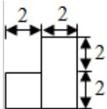
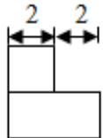
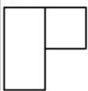

<!-- question-source:start -->
11. (6 分) (2016·浙江) 某几何体的三视图如图所示 (单位: cm), 则该几何体的表面积是 $\mathrm{cm}^{2}$ , 体积是 $\mathrm{cm}^{3}$ .

  
正视图

  
侧视图

  
俯视图
<!-- question-source:end -->

![[高中/真题/按年份分类/2016/2016年浙江高考数学_理科_试卷_含答案_/填空题/题目/answers/Q00026157A1.md]]
