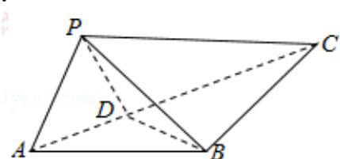

<!-- question-source:start -->
14. (4分) (2016·浙江) 如图, 在 $\triangle ABC$ 中, $AB=BC=2$ , $\angle ABC=120^{\circ}$ . 若平面 $ABC$ 外的点 $P$ 和线段 $AC$ 上的点 $D$ , 满足 $PD=DA$ , $PB=BA$ , 则四面体 $PBCD$ 的体积的最大值是

<!-- question-source:end -->

![[高中/真题/按年份分类/2016/2016年浙江高考数学_理科_试卷_含答案_/填空题/题目/answers/Q00026160A1.md]]
