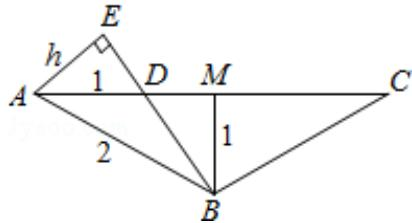
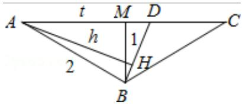

> [!faq]- 2016年浙江高考数学(理科)试卷(含答案)解析
>
> > [!success]- **【答案】** 为： $\frac{1}{2}$ . 【点评】本题考查体积最大值的计算，考查学生转化问题的能力，考查分类讨论的数学思想，对思维能力和解题技巧有一定要求，难度大.
>
> > [!note]- **【分析】**
> > 由题意， $\triangle ABD \cong \triangle PBD$ ，可以理解为 $\triangle PBD$ 是由 $\triangle ABD$ 绕着 BD 旋转得到的，对于每段固定的 AD，底面积 BCD 为定值，要使得体积最大， $\triangle PBD$ 必定垂直于平面 ABC，此时高最大，体积也最大。
>
> > [!note]- **【解析】**
> > 分析】由题意， $\triangle ABD \cong \triangle PBD$ ，可以理解为 $\triangle PBD$ 是由 $\triangle ABD$ 绕着 BD 旋转得到的，对于每段固定的 AD，底面积 BCD 为定值，要使得体积最大， $\triangle PBD$ 必定垂直于平面 ABC，此时高最大，体积也最大。
> >
> > 【
> > 解答】解：如图，M 是 AC 的中点.
> >
> > ① 当 $AD = t < AM = \sqrt{3}$ 时，如图，此时高为P到BD的距离，也就是A到BD的距离，即图中
> >
> > 
> >
> > AE,
> >
> > DM= $\sqrt{3}-t$ ，由 $\triangle ADE\sim\triangle BDM$ ，可得 $\frac{h}{1}=\frac{t}{\sqrt{\left(\sqrt{3}-t\right)^{2}+1}}$ ， $\therefore h=\frac{t}{\sqrt{\left(\sqrt{3}-t\right)^{2}+1}}$
> >
> > $$
> > V = \frac {1}{3} \cdot \frac {1}{2} \cdot (2 \sqrt {3} - t) \cdot 1 \cdot \frac {t}{\sqrt {(\sqrt {3} - t)} ^ {2} + 1} = \frac {1}{6} \cdot \frac {3 - (\sqrt {3} - t) ^ {2}}{\sqrt {(\sqrt {3} - t)} ^ {2} + 1}, t \in (0, \sqrt {3})
> > $$
> >
> > ② 当 $AD=t>AM=\sqrt{3}$ 时，如图，此时高为 P 到 BD 的距离，也就是 A 到 BD 的距离，即图中
> >
> > 
> >
> > AH,
> >
> > DM=t- $\sqrt{3}$ ，由等面积，可得 $\frac{1}{2}\cdot AD\cdot BM=\frac{1}{2}\cdot BD\cdot AH,\quad\therefore\frac{1}{2}\cdot t\cdot1=\frac{1}{2}\sqrt{(t-\sqrt{3})^{2}+1}$
> >
> > $\therefore h = \frac{t}{\sqrt{(\sqrt{3} - t)^2 + 1}}$
> >
> > $$
> > \therefore V = \frac {1}{3} \cdot \frac {1}{2} \cdot (2 \sqrt {3} - t) \cdot 1 \cdot \frac {t}{\sqrt {(\sqrt {3} - t)} ^ {2} + 1} = \frac {1}{6} \cdot \frac {3 - (\sqrt {3} - t) ^ {2}}{\sqrt {(\sqrt {3} - t)} ^ {2} + 1}, t \in (\sqrt {3}, 2 \sqrt {3})
> > $$
> >
> > 综上所述， $V=\frac{1}{6}\cdot\frac{3-\left(\sqrt{3}-t\right)^{2}}{\sqrt{\left(\sqrt{3}-t\right)^{2}+1}},\quad t\in(0,2\sqrt{3})$
> >
> > 令 $m=\sqrt{(\sqrt{3}-t)^{2}+1}\in[1,2)$ ，则 $V=\frac{1}{6}\cdot\frac{4-m^{2}}{m}$ ，∴m=1时， $V_{max}=\frac{1}{2}$
> >
> > 故
> > 答案为： $\frac{1}{2}$ .
> >
> > 【点评】本题考查体积最大值的计算，考查学生转化问题的能力，考查分类讨论的数学思想，对思维能力和解题技巧有一定要求，难度大.
