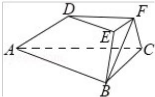

<!-- question-source:start -->
17. （15 分）（2016·浙江）如图，在三棱台 ABC-DEF 中，已知平面 BCFE⊥平面 ABC， $\angle ACB=90^{\circ}$ ，BE=EF=FC=1，BC=2，AC=3，

（Ⅰ）求证：EF⊥平面ACFD；

（Ⅱ）求二面角 B - AD - F 的余弦值.

<!-- question-source:end -->

![[高中/真题/按年份分类/2016/2016年浙江高考数学_理科_试卷_含答案_/解答题/题目/answers/Q00026163A1.md]]
