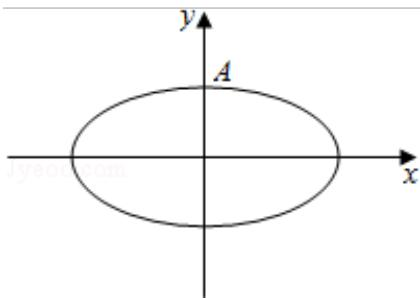

<!-- question-source:start -->
19. (15 分) (2016·浙江) 如图, 设椭圆 C: $\frac{\mathbf{x}^2}{\mathbf{a}^2} + \mathbf{y}^2 = 1$ ( $a > 1$ )

（Ⅰ）求直线 $y=kx+1$ 被椭圆截得到的弦长（用 a，k 表示）

（Ⅱ）若任意以点 A(0,1) 为圆心的圆与椭圆至多有三个公共点，求椭圆的离心率的取值范围.

<!-- question-source:end -->

![[高中/真题/按年份分类/2016/2016年浙江高考数学_理科_试卷_含答案_/解答题/题目/answers/Q00026165A1.md]]
