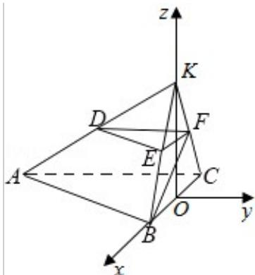
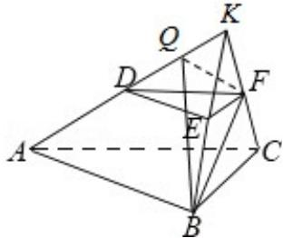

> [!faq]- 2016年浙江高考数学(理科)试卷(含答案)解析
>
> > [!success]- **【答案】** 详见解析
>
> > [!note]- **【分析】**
> > （I）先证明 BF⊥AC，再证明 BF⊥CK，进而得到 BF⊥平面 ACFD.
>
> > [!note]- **【解析】**
> > （I）证明：延长AD，BE，CF相交于点K，如图所示，∵平面BCFE⊥平面ABC， $\angle ACB=90^{\circ}$ ，
> >
> > ∴AC⊥平面 BCK，∴BF⊥AC.
> >
> > 又 EF∥BC, BE=EF=FC=1, BC=2, ∴△BCK 为等边三角形，且 F 为 CK 的中点，则 BF⊥CK, ∴BF⊥平面 ACFD.
> >
> > （II）方法一：过点 F 作 FQ⊥AK，连接 BQ，∵BF⊥平面 ACFD．∴BF⊥AK，则 AK⊥平面 BQF，
> >
> > ∴BQ⊥AK. ∴∠BQF 是二面角 B-AD-F 的平面角.
> >
> > 在 Rt△ACK 中，AC=3，CK=2，可得 FQ= $\frac{3\sqrt{13}}{13}$ .
> >
> > 在 Rt△BQF 中，BF= $\sqrt{3}$ ，FQ= $\frac{3\sqrt{13}}{13}$ 。可得：cos∠BQF= $\frac{\sqrt{3}}{4}$ 。
> >
> > ∴二面角 B - AD - F 的平面角的余弦值为 $\frac{\sqrt{3}}{4}$ .
> >
> > 方法二：如图，延长AD，BE，CF相交于点K，则 $\triangle BCK$ 为等边三角形，
> >
> > 取 BC 的中点，则 KO⊥BC，又平面 BCFE⊥平面 ABC，∴KO⊥平面 BAC，
> >
> > 以点 O 为原点，分别以 OB，OK 的方向为 x，z 的正方向，建立空间直角坐标系 O-xyz.
> > 可得：B(1,0,0)，C(-1,0,0)，K(0,0, $\sqrt{3}$ )，A(-1,-3,0)，E( $\frac{1}{2}$ ，0， $\frac{\sqrt{3}}{2}$ )，
> > F( $-\frac{1}{2}$ ，0， $\frac{\sqrt{3}}{2}$ ) $\overrightarrow{AC}=$ (0,3,0)， $\overrightarrow{AK}=$ (1,3, $\sqrt{3}$ )， $\overrightarrow{AB}$ (2,3,0).
> >
> > 设平面 ACK 的法向量为 $\vec{\pi}=(x_{1},y_{1},z_{1})$ ，平面 ABK 的法向量为 $\vec{n}=(x_{2},y_{2},z_{2})$ ，由 $\left\{\begin{aligned}\overrightarrow{AC}&\cdot\overrightarrow{m}=0,\\\overrightarrow{AK}&\cdot\overrightarrow{m}=0\end{aligned}\right.$ 可得 $\left\{\begin{aligned}3y_{1}&=0\\ x_{1}&+3y_{1}+\sqrt{3}z_{1}&=0\end{aligned}\right.$ 取 $\vec{\pi}=\left(\sqrt{3},0,-1\right)$
> >
> > 由 $\left\{ \begin{array}{l} \overrightarrow{\mathrm{AB}} \cdot \overrightarrow{\mathrm{n}} = 0 \\ \overrightarrow{\mathrm{AK}} \cdot \overrightarrow{\mathrm{n}} = 0 \end{array} \right.$ ，可得 $\left\{ \begin{array}{l} 2x_2 + 3y_2 = 0 \\ x_2 + 3y_2 + \sqrt{3}z_2 = 0 \end{array} \right.$ ，取 $\overrightarrow{\mathrm{n}} = (3, -2, \sqrt{3})$ 。
> >
> > $\therefore \cos < \vec{m}, \vec{n} > = \frac{\vec{m} \cdot \vec{n}}{|\vec{m}| |\vec{n}|} = \frac{\sqrt{3}}{4}$ .
> >
> > ∴二面角 B - AD - F 的余弦值为 $\frac{\sqrt{3}}{4}$ .
> >
> > 
> >
> > 
> >
> > 【点评】本题考查了空间位置关系、法向量的应用、空间角，考查了空间想象能力、推理能力与计算能力，属于中档题.
