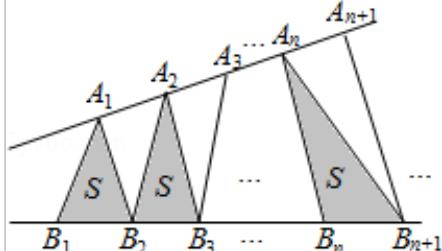

<!-- question-source:start -->
5. （5分）（2016·浙江）设函数 $f(x) = \sin^2 x + b\sin x + c$ ，则 $f(x)$ 的最小正周期（）
A. 与 b 有关，且与 c 有关 B. 与 b 有关，但与 c 无关
C. 与 b 无关，且与 c 无关 D. 与 b 无关，但与 c 有关

$$
\left\{\mathrm{A} _ {\mathrm{n}} \right\} 、 \left\{\mathrm{B} _ {\mathrm{n}} \right\}
$$

$$
\left| \mathrm{A} _ {\mathrm{n}} \mathrm{A} _ {\mathrm{n} + 1} \right| = |
$$

$A_{n+1}A_{n+2}|, A_n \neq A_{n+1}, n \in N^*, |B_nB_{n+1}| = |B_{n+1}B_{n+2}|, B_n \neq B_{n+1}, n \in N^*, (P \neq Q \text{ 表示点 P 与 Q 不重合})$ 若 $d_n = |A_nB_n|$ ， $S_n$ 为 $\triangle A_nB_nB_{n+1}$ 的面积，则（）

A. $\{\mathrm{S_n}\}$ 是等差数列 B. $\{\mathrm{S_n}^2\}$ 是等差数列 C. $\{\mathrm{d_n}\}$ 是等差数列 D. $\{\mathrm{d_n}^2\}$ 是等差数列
<!-- question-source:end -->

![[高中/真题/按年份分类/2016/2016年浙江高考数学_理科_试卷_含答案_/选择题/题目/answers/Q00026152A1.md]]
