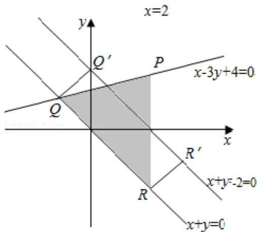

> [!faq]- 2016年浙江高考数学(理科)试卷(含答案)解析
>
> > [!success]- **【答案】** 详见解析
>
> > [!note]- **【分析】**
> > 作出不等式组对应的平面区域，利用投影的定义，利用数形结合进行求解即可.
>
> > [!note]- **【解析】**
> > 解：作出不等式组对应的平面区域如图：（阴影部分），
> >
> > 区域内的点在直线 $x+y-2=0$ 上的投影构成线段 $R'Q'$ ，即 SAB，
> >
> > 而 $R'Q'=RQ,$
> >
> > 由 $\left\{\begin{aligned}x-3y+4&=0\\ x+y&=0\end{aligned}\right.$ 得 $\left\{\begin{aligned}x&=-1\\ y&=1\end{aligned}\right.$ ，即Q $(-1,1)$ ，
> >
> > 由 $\left\{\begin{aligned}x=2& \text{得}\left\{\begin{aligned}x=2\\ y=-2\end{aligned}\right.\end{aligned}\right.$ ，即R $(2,-2)$ ，
> >
> > 则 $|AB|=|QR|=\sqrt{(-1-2)^{2}+(1+2)^{2}}=\sqrt{9+9}=3\sqrt{2}$
> >
> > 故选：C
> >
> > 
> >
> > 【点评】本题主要考查线性规划的应用,作出不等式组对应的平面区域,利用投影的定义以及数形结合是解决本题的关键.
