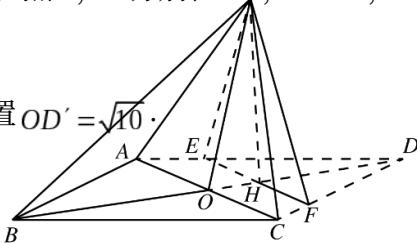

<!-- question-source:start -->
17. (本小题满分 12 分)

$S_{n}$ 为等差数列 $\left\{a_{n}\right\}$ 的前 $n$ 项和，且 $a_{1} = 1, S_{7} = 28, b_{n} = \left[\lg a_{n}\right],$ 其中 $[x]$ 表示不超过 $x$ 的最大整数，如 $[0.9] = 0, [\lg 99] = 1.$

(I) 求 $b_{1}$ , $b_{11}$ , $b_{101}$ ;

（II）求数列 $\left\{b_{n}\right\}$ 的前1000项和.

## 18. (本小题满分 12 分)

某险种的基本保费为 $a$ （单位：元），继续购买该险种的投保人称为续保人，续保人本年度的保费与其上年度出险次数的关联如下：

<table><tr><td>上年度出险次数</td><td>0</td><td>1</td><td>2</td><td>3</td><td>4</td><td> $\geq 5$ </td></tr><tr><td>保费</td><td>0.85a</td><td>a</td><td>1.25a</td><td>1.5a</td><td>1.75a</td><td>2a</td></tr></table>

设该险种一续保人一年内出险次数与相应概率如下：

<table><tr><td>一年内出险次数</td><td>0</td><td>1</td><td>2</td><td>3</td><td>4</td><td> $\geq 5$ </td></tr><tr><td>概率</td><td>0.30</td><td>0.15</td><td>0.20</td><td>0.20</td><td>0.10</td><td>0.05</td></tr></table>

（Ⅰ）求一续保人本年度的保费高于基本保费的概率；

（Ⅱ）若一续保人本年度的保费高于基本保费，求其保费比基本保费高出60%的概率；

（III）求续保人本年度的平均保费与基本保费的比值.

## 19. (本小题满分 12 分)

如图，菱形ABCD的对角线AC与BD交于点O，AB=5，AC=6，点E，F分别在ADp' CD上，

$AE = CF = \frac{5}{4}$ ， $EF$ 交 $BD$ 于点 $H.$ 将 $\triangle DEF$ 沿 $EF$ 折到 $\triangle D'EF$ 的位置 $OD'$

(I) 证明: $D'H \perp$ 平面ABCD;

(II) 求二面角 $B - D'A - C$ 的正弦值.

## 20. (本小题满分 12 分)

已知椭圆 $E: \frac{x^2}{t} + \frac{y^2}{3} = 1$ 的焦点在 $x$ 轴上， $A$ 是 $E$ 的左顶点，斜率为 $k (k > 0)$ 的直线交 $E$ 于 $A$ ， $M$ 两点，点 $N$ 在 $E$ 上， $MA \perp NA$ .

(I) 当 $t = 4$ ， $|AM| = |AN|$ 时，求 $\triangle AMN$ 的面积；

(II) 当 $2|AM| = |AN|$ 时，求 k 的取值范围.
<!-- question-source:end -->

![[高中/真题/按年份分类/2016/2016年理科数学海南省高考真题含答案/解答题/题目/answers/Q00026092A1.md]]
