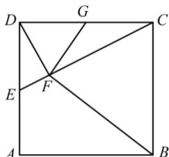

<!-- question-source:start -->
22. （本小题满分 10 分）选修 4-1：几何证明选讲

如图，在正方形ABCD，E，G分别在边DA，DC上（不与端点重合），且 $DE = DG$ ，过D点作

$DF \perp CE$ ，垂足为 $F$ .

(I) 证明: $B, C, G, F$ 四点共圆;

(II)若 $AB = 1$ ， $E$ 为 $DA$ 的中点，求四边形BCGF的面积.

<!-- question-source:end -->

![[高中/真题/按年份分类/2016/2016年理科数学海南省高考真题含答案/解答题/题目/answers/Q00026094A1.md]]
