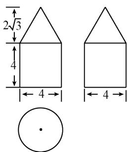

<!-- question-source:start -->
5. 如图，小明从街道的 E 处出发，先到 F 处与小红会合，再一起到位于 G处的老年公寓参加志愿者活动，则小明到老年公寓可以选择的最短路径条数为
(A) 24 (B) 18 (C) 12 (D) 9

<!-- question-source:end -->

![[高中/真题/按年份分类/2016/2016年理科数学海南省高考真题含答案/选择题/题目/answers/Q00026082A1.md]]
