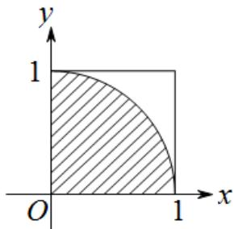

> [!faq]- 2016年理科数学海南省高考真题含答案解析
>
> > [!success]- **【答案】** 从区间 $\left[0,1\right]$ 随机抽取 $2n$ 个数 $x_{1}, x_{2}, \cdots, x_{n}, y_{1}, y_{2}, \cdots, y_{n}$ , 构成 $n$ 个数对 $(x_{1},y_{1}), (x_{2},y_{2}), \cdots, (x_{n},y_{n})$ , 其中两数的平方和小于
>
> > [!note]- **【分析】**
> > 本题解析推导如下：
>
> > [!note]- **【解析】**
> > C
> >
> > 由题意得： $(x_{i}, y_{i})(i=1,2,\cdots,n)$ 在如图所示方格中，而平方和小于1的点均在
> >
> > 如图所示的阴影中
> >
> > 
> >
> > 由几何概型概率计算公式知 $\frac{\frac{\pi}{4}}{1} = \frac{m}{n}$ ， $\therefore \pi = \frac{4m}{n}$ ，故选C.
