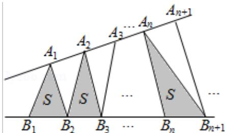

# 2016年浙江省高考数学试卷（文科）

##
一、选择题

1. (5 分) (2016·浙江) 已知全集 $U = \{1, 2, 3, 4, 5, 6\}$ , 集合 $P = \{1, 3, 5\}$ , $Q = \{1, 2, 4\}$ , 则 $(C_U P) \cup Q = (\quad)$

A. $\{1\}$ B. $\{3,5\}$ C. $\{1,2,4,6\}$ D. $\{1,2,3,4,5\}$

2. (5 分) (2016·浙江) 已知互相垂直的平面 $\alpha, \beta$ 交于直线 $l$ , 若直线 $m, n$ 满足 $m \| \alpha, n \perp \beta$ , 则（）

A. m|| B. m||n C. n⊥l D. m⊥n

3. (5 分) (2016·浙江) 函数 $y = \sin x^2$ 的图象是 ( )

A.

B.

C.

D.

4. (5 分) (2016·浙江) 若平面区域 $\left\{\begin{aligned}x+y-3&\geqslant0\\ 2x-y-3&\leqslant0\\ x-2y+3&\geqslant0\end{aligned}\right.$ ，夹在两条斜率为 1 的平行直线之间，则

这两条平行直线间的距离的最小值是（）
A. $\frac{3\sqrt{5}}{5}$ B. $\sqrt{2}$ C. $\frac{3\sqrt{2}}{2}$ D. $\sqrt{5}$

5. （5分）（2016·浙江）已知 a，b > 0 且 a = 1，b = 1，若 $\log_{a}b > 1$ ，则（）
A. (a - 1) (b - 1) < 0 B. (a - 1) (a - b) > 0 C. (b - 1) (b - a) < 0 D. (b - 1) (b - a) > 0

6. (5 分) (2016·浙江) 已知函数 $f(x) = x^2 + bx$ ，则 “ $b < 0$ ” 是 “ $f(f(x))$ 的最小值与 $f(x)$ 的最小值相等” 的（）
A. 充分不必要条件 B. 必要不充分条件
C. 充分必要条件 D. 既不充分也不必要条件

7. (5分) (2016·浙江) 已知函数 $f(x)$ 满足: $f(x) \geqslant |x|$ 且 $f(x) \geqslant 2^x$ , $x \in \mathbb{R}$ . ( )
A. 若 $f(a) \leqslant |b|$ , 则 $a \leqslant b$ B. 若 $f(a) \leqslant 2^b$ , 则 $a \leqslant b$ C. 若 $f(a) \geqslant |b|$ , 则 $a \geqslant b$ D. 若 $f(a) \geqslant 2^b$ , 则 $a \geqslant b$

8. (5 分) (2016·浙江) 如图, 点列 $\{A_{n}\} 、 \{B_{n}\}$ 分别在某锐角的两边上, 且 $|A_{n}A_{n+1}| = |A_{n+1}A_{n+2}|$ , $A_{n} = A_{n+1}$ , $n \in N^{*}$ , $|B_{n}B_{n+1}| = |B_{n+1}B_{n+2}|$ , $B_{n} = B_{n+1}$ , $n \in N^{*}$ , (P = Q 表示点 P 与 Q 不重合) 若 $d_{n} = |A_{n}B_{n}|$ , $S_{n}$ 为 $\triangle A_{n}B_{n}B_{n+1}$ 的面积, 则 ( )

A. $\{S_{n}\}$ 是等差数列B. $\{S_{n}^{2}\}$ 是等差数列C. $\{d_{n}\}$ 是等差数列D. $\{d_{n}^{2}\}$ 是等差数列

##

![[高中/真题/按年份分类/2016/2016年高考浙江文科数学试题及答案_精校版_/填空题/填空题.md]]
![[高中/真题/按年份分类/2016/2016年高考浙江文科数学试题及答案_精校版_/解答题/解答题.md]]
![[高中/真题/按年份分类/2016/2016年高考浙江文科数学试题及答案_精校版_/选择题/选择题.md]]
