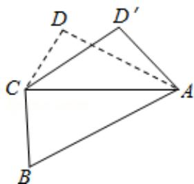

<!-- question-source:start -->
14. （4分）（2016·浙江）如图，已知平面四边形ABCD，AB=BC=3，CD=1，AD= $\sqrt{5}$ ， $\angle ADC=90^{\circ}$ ，沿直线AC将 $\triangle ACD$ 翻折成 $\triangle ACD'$ ，直线AC与BD'所成角的余弦的最大值是。

<!-- question-source:end -->

![[高中/真题/按年份分类/2016/2016年高考浙江文科数学试题及答案_精校版_/填空题/题目/answers/Q00023543A1.md]]
