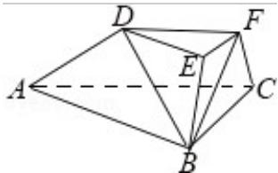

<!-- question-source:start -->
18. （15分）（2016·浙江）如图，在三棱台ABC-DEF中，平面BCFE⊥平面ABC， $\angle ACB = 90^{\circ}$ ，BE=EF=FC=1，BC=2，AC=3。

（Ⅰ）求证：BF⊥平面ACFD；

（II）求直线 BD 与平面 ACFD 所成角的余弦值.

<!-- question-source:end -->

![[高中/真题/按年份分类/2016/2016年高考浙江文科数学试题及答案_精校版_/填空题/题目/answers/Q00023547A1.md]]
