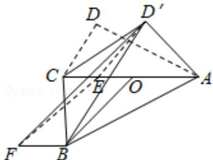

> [!faq]- 2016年高考浙江文科数学试题及答案(精校版)解析
>
> > [!success]- **【答案】** $\frac{\sqrt{6}}{6}$
>
> > [!note]- **【分析】**
> > 如图所示，取AC的中点O，AB=BC=3，可得BO⊥AC，在Rt△ACD'中，AC= $\sqrt{6}$ 。作D'E⊥AC，垂足为E，D'E= $\frac{\sqrt{30}}{6}$ 。CO= $\frac{\sqrt{6}}{2}$ ，CE= $\frac{D^{'}C^{2}}{CA}=\frac{\sqrt{6}}{6}$ ，EO=CO-CE= $\frac{\sqrt{6}}{3}$ 。过点B作BF∥BO，作FE∥BO交BF于点F，则EF⊥AC。连接D'F。∠FBD'为直线AC与BD'所成的角。则四边形BOEF为矩形，BF=EO= $\frac{\sqrt{6}}{3}$ 。EF=BO= $\frac{\sqrt{30}}{2}$ 。则∠FED'为二面角D'-CA-B的平面角，设为θ。利用余弦定理求出D'F²的最小值即可得出。
>
> > [!note]- **【解析】**
> > 解：如图所示，取AC的中点O，∵AB=BC=3，∴BO⊥AC，
> > 在Rt△ACD'中， $AC=\sqrt{1^{2}+(\sqrt{5})^{2}}=\sqrt{6}$ .
> > 作D'E⊥AC，垂足为E，D'E= $\frac{1\times\sqrt{5}}{\sqrt{6}}=\frac{\sqrt{30}}{6}$ $CO=\frac{\sqrt{6}}{2}$ ， $CE=\frac{D^{'C}^{2}}{CA}=\frac{1}{\sqrt{6}}=\frac{\sqrt{6}}{6}$ ∴EO=CO-CE= $\frac{\sqrt{6}}{3}$ .
> > 过点B作BF∥BO，作FE∥BO交BF于点F，则EF⊥AC.连接D'F.∠FBD'为直线AC与BD'所成的角.
> > 则四边形BOEF为矩形，∴BF=EO= $\frac{\sqrt{6}}{3}$ .
> > EF=BO= $\sqrt{3^{2}-(\frac{\sqrt{6}}{2})^{2}}=\frac{\sqrt{30}}{2}$ .
> > 则∠FED'为二面角D'-CA-B的平面角，设为θ.
> > 则D'F²=( $\frac{\sqrt{30}}{6}$ )²+( $\frac{\sqrt{30}}{2}$ )²-2× $\frac{\sqrt{30}}{6}$ × $\frac{\sqrt{30}}{2}$ cosθ= $\frac{25}{3}-5\cos\theta\geq\frac{10}{3}$ ，cosθ=1时取等号.
> > ∴D'B的最小值= $\sqrt{\frac{10}{3}+\left(\frac{\sqrt{6}}{3}\right)^{2}}=2$ .
> > ∴直线AC与BD'所成角的余弦的最大值= $\frac{BF}{D^{'B}}=\frac{\sqrt{6}}{\frac{3}{2}}=\frac{\sqrt{6}}{6}$ 故答案为： $\frac{\sqrt{6}}{6}$
> >
> > 
