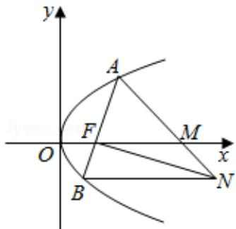

<!-- question-source:start -->
19. (15 分) (2016·浙江) 如图, 设抛物线 $y^{2} = 2px$ ( $p > 0$ ) 的焦点为 $F$ , 抛物线上的点 $A$ 到 $y$ 轴的距离等于 $|AF| - 1$ ,

(Ⅰ) 求 p 的值;

（II）若直线 AF 交抛物线于另一点 B，过 B 与 x 轴平行的直线和过 F 与 AB 垂直的直线交于点 N，AN 与 x 轴交于点 M，求 M 的横坐标的取值范围.

<!-- question-source:end -->

![[高中/真题/按年份分类/2016/2016年高考浙江文科数学试题及答案_精校版_/解答题/题目/answers/Q00023548A1.md]]
