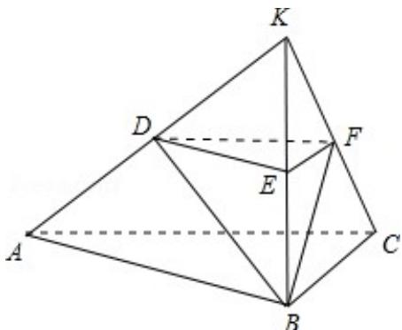

> [!faq]- 2016年高考浙江文科数学试题及答案(精校版)解析
>
> > [!success]- **【答案】** （15分）（2016·浙江）如图，在三棱台ABC-DEF中，平面BCFE⊥平面ABC， $\angle ACB=90^{\circ}$ ，BE=EF=FC=1，BC=2，AC=3。
>
> > [!note]- **【分析】**
> > （Ⅰ）根据三棱台的定义，可知分别延长AD，BE，CF，会交于一点，并设该点为K，并且可以由平面BCFE⊥平面ABC及∠ACB=90°可以得出AC⊥平面BCK，进而得出BF⊥AC。而根据条件可以判断出点E，F分别为边BK，CK的中点，从而得出△BCK为等边三角形，进而得出BF⊥CK，从而根据线面垂直的判定定理即可得出BF⊥平面ACFD；
>
> > [!note]- **【解析】**
> > 解：（Ⅰ）证明：延长 AD，BE，CF 相交于一点 K，如图所示：
> >
> > ∵平面 BCFE⊥平面 ABC，且 AC⊥BC；
> >
> > ∴AC⊥平面 BCK，BFC平面 BCK;
> >
> > $\therefore BF \perp AC;$
> >
> > 又 $EF \parallel BC$ ， $BE = EF = FC = 1$ ， $BC = 2$
> >
> > $\therefore \triangle BCK$ 为等边三角形，且 $F$ 为 $CK$ 的中点；
> >
> > ∴BF⊥CK，且AC∩CK=C;
> >
> > ∴BF⊥平面ACFD;
> >
> > (II) $\because BF \perp$ 平面 ACFD;
> >
> > ∴∠BDF 是直线 BD 和平面 ACFD 所成的角；
> >
> > ∵F为CK中点，且DF∥AC;
> >
> > ∴DF 为△ACK 的中位线，且 AC=3;
> >
> > $\therefore \mathrm{DF} = \frac{3}{2};$
> >
> > 又 $\mathrm{BF} = \sqrt{3}$ ;
> >
> > ∴在 Rt△BFD 中， $BD=\sqrt{3+\frac{9}{4}}=\frac{\sqrt{21}}{2}$ ， $\cos\angle BDF=\frac{DF}{BD}=\frac{\frac{3}{2}}{\frac{\sqrt{21}}{2}}=\frac{\sqrt{21}}{7}$ ;
> >
> > 即直线 BD 和平面 ACFD 所成角的余弦值为 $\frac{\sqrt{21}}{7}$ .
> >
> > 
