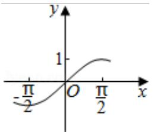
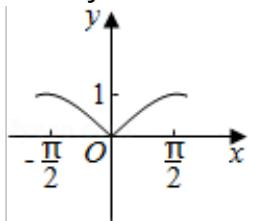
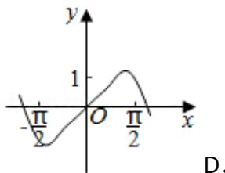
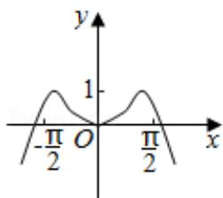

<!-- question-source:start -->
3. (5 分) (2016·浙江) 函数 $y = \sin x^2$ 的图象是 ( )

A.

B.

C.

D.

【
<!-- question-source:end -->

![[高中/真题/按年份分类/2016/2016年高考浙江文科数学试题及答案_精校版_/选择题/题目/answers/Q00028553A1.md]]
