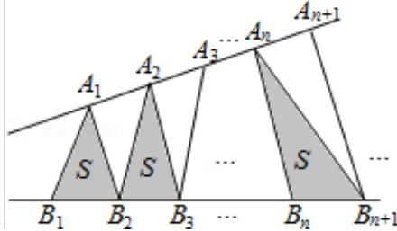

<!-- question-source:start -->
8. (5 分) (2016·浙江) 如图, 点列 $\{A_{n}\} 、 \{B_{n}\}$ 分别在某锐角的两边上, 且 $|A_{n}A_{n+1}| = |A_{n+1}A_{n+2}|$ , $A_{n} = A_{n+1}$ , $n \in N^{*}$ , $|B_{n}B_{n+1}| = |B_{n+1}B_{n+2}|$ , $B_{n} = B_{n+1}$ , $n \in N^{*}$ , (P = Q 表示点 P 与 Q 不重合) 若 $d_{n} = |A_{n}B_{n}|$ , $S_{n}$ 为 $\triangle A_{n}B_{n}B_{n+1}$ 的面积, 则 ( )

A. $\{S_{n}\}$ 是等差数列B. $\{S_{n}^{2}\}$ 是等差数列C. $\{d_{n}\}$ 是等差数列D. $\{d_{n}^{2}\}$ 是等差数列
<!-- question-source:end -->

![[高中/真题/按年份分类/2016/2016年高考浙江文科数学试题及答案_精校版_/选择题/题目/answers/Q00031352A1.md]]
