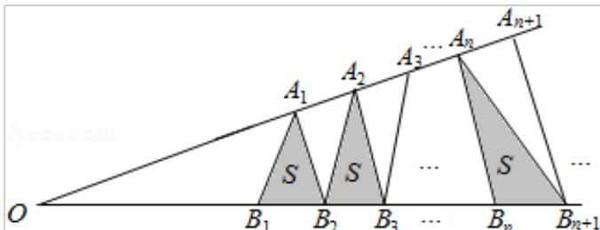

> [!faq]- 2016年高考浙江文科数学试题及答案(精校版)解析
>
> > [!success]- **【答案】** A
>
> > [!note]- **【分析】**
> > 设锐角的顶点为 O，再设 $\left|OA_{1}\right|=a,\left|OB_{1}\right|=b,\left|A_{n}A_{n+1}\right|=\left|A_{n+1}A_{n+2}\right|=b,\left|B_{n}B_{n+1}\right|=\left|B_{n+1}B_{n+2}\right|=d$ ，由于 a，b 不确定，判断 C，D 不正确，设 $\triangle A_{n}B_{n}B_{n+1}$ 的底边 $B_{n}B_{n+1}$ 上的高为 $h_{n}$ ，运用三角形相似知识， $h_{n}+h_{n+2}=2h_{n+1}$ ，由 $S_{n}=\frac{1}{2}d\cdot h_{n}$ ，可得 $S_{n}+S_{n+2}=2S_{n+1}$ ，进而得到数列 $\{S_{n}\}$ 为等差数列.
>
> > [!note]- **【解析】**
> > 分析】设锐角的顶点为 O，再设 $\left|OA_{1}\right|=a,\left|OB_{1}\right|=b,\left|A_{n}A_{n+1}\right|=\left|A_{n+1}A_{n+2}\right|=b,\left|B_{n}B_{n+1}\right|=\left|B_{n+1}B_{n+2}\right|=d$ ，由于 a，b 不确定，判断 C，D 不正确，设 $\triangle A_{n}B_{n}B_{n+1}$ 的底边 $B_{n}B_{n+1}$ 上的高为 $h_{n}$ ，运用三角形相似知识， $h_{n}+h_{n+2}=2h_{n+1}$ ，由 $S_{n}=\frac{1}{2}d\cdot h_{n}$ ，可得 $S_{n}+S_{n+2}=2S_{n+1}$ ，进而得到数列 $\{S_{n}\}$ 为等差数列.
> >
> > 【
> > 解答】解：设锐角的顶点为 O， $|OA_{1}|=a,\quad|OB_{1}|=b,$ $|A_{n}A_{n+1}|=|A_{n+1}A_{n+2}|=b,\quad|B_{n}B_{n+1}|=|B_{n+1}B_{n+2}|=d,$ 由于 a，b 不确定，则 $\{d_{n}\}$ 不一定是等差数列， $\{d_{n}^{2}\}$ 不一定是等差数列，
> >
> > 设 $\triangle A_{n}B_{n}B_{n+1}$ 的底边 $B_{n}B_{n+1}$ 上的高为 $h_{n}$ ,
> >
> > 由三角形的相似可得 $\frac{h_{n}}{h_{n+1}}=\frac{OA_{n}}{OA_{n+1}}=\frac{a+(n-1)b}{a+nb},$ $\frac{h_{n+2}}{h_{n+1}}=\frac{OA_{n+2}}{OA_{n+1}}=\frac{a+(n+1)b}{a+nb},$ 两式相加可得， $\frac{h_{n}+h_{n+2}}{h_{n+1}}=\frac{2a+2nb}{a+nb}=2,$ 即有 $h_{n}+h_{n+2}=2h_{n+1}$ ,
> >
> > 由 $S_{n}=\frac{1}{2}d\cdot h_{n}$ ，可得 $S_{n}+S_{n+2}=2S_{n+1}$ ,
> >
> > 即为 $S_{n+2}-S_{n+1}=S_{n+1}-S_{n}$ ,
> >
> > 则数列 $\{S_{n}\}$ 为等差数列.
> >
> > 故选：A.
> >
> > 
> >
> > 【点评】本题考查等差数列的判断，注意运用三角形的相似和等差数列的性质，考查化简整理的推理能力，属于中档题.
> >
> > ## 二、填空题
