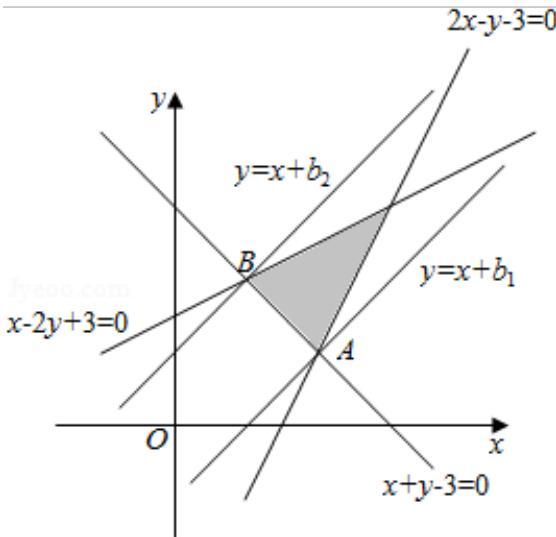

> [!faq]- 2016年高考浙江文科数学试题及答案(精校版)解析
>
> > [!success]- **【答案】** B
>
> > [!note]- **【分析】**
> > 作出平面区域，找出距离最近的平行线的位置，求出直线方程，再计算距离.
>
> > [!note]- **【解析】**
> > 解：作出平面区域如图所示：
> >
> > 
> >
> > ∴当直线 $y=x+b$ 分别经过 A，B 时，平行线间的距离相等.
> >
> > 联立方程组 $\left\{\begin{aligned}x+y-3&=0\\ 2x-y-3&=0\end{aligned}\right.$ ，解得A（2，1），
> >
> > 联立方程组 $\left\{ \begin{array}{l} x + y - 3 = 0 \\ x - 2y + 3 = 0 \end{array} \right.$ ，解得 B（1，2）.
> >
> > 两条平行线分别为 $y = x - 1$ ， $y = x + 1$ ，即 $x - y - 1 = 0$ ， $x - y + 1 = 0$ 。  
> > ∴平行线间的距离为 $d = \frac{|-1 - 1|}{\sqrt{2}} = \sqrt{2}$ ，
> >
> > 故选：B.
> >
> > 【点评】本题考查了平面区域的作法，距离公式的应用，属于基础题.
