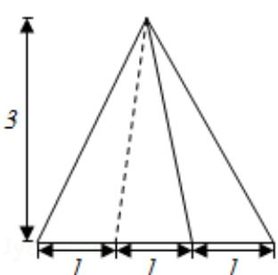
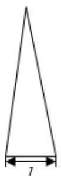
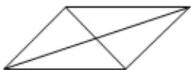

<!-- question-source:start -->
11.（5 分）（2016·天津）已知一个四棱锥的底面是平行四边形，该四棱锥的三视图如图所示（单位：m），则该四棱锥的体积为

$$
\mathrm{m} ^ {3}
$$

  
正视图

  
侧视图

  
俯视图
<!-- question-source:end -->

![[高中/真题/按年份分类/2016/2016年高考理科数学试题_天津卷_及参考答案/填空题/题目/answers/Q00026045A1.md]]
