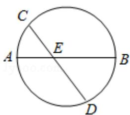

<!-- question-source:start -->
12. （5分）（2016·天津）如图，AB是圆的直径，弦CD与AB相交于点E，BE=2AE=2，BD=ED，则线段CE的长为\_\_\_\_。

<!-- question-source:end -->

![[高中/真题/按年份分类/2016/2016年高考理科数学试题_天津卷_及参考答案/填空题/题目/answers/Q00026046A1.md]]
