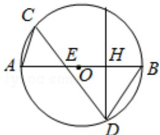

> [!faq]- 2016年高考理科数学试题(天津卷)及参考答案解析
>
> > [!success]- **【答案】** 为： $\frac{2\sqrt{3}}{3}$ .  【点评】本题考查与圆有关的比例线段，考查相交弦定理的应用，是中档题.
>
> > [!note]- **【分析】**
> > 由 BD=ED，可得△BDE 为等腰三角形，过 D 作 DH⊥AB 于 H，由相交弦定理求得 DH，在 Rt△DHE 中求出 DE，再由相交弦定理求得 CE.
>
> > [!note]- **【解析】**
> > 分析】由 BD=ED，可得△BDE 为等腰三角形，过 D 作 DH⊥AB 于 H，由相交弦定理求得 DH，在 Rt△DHE 中求出 DE，再由相交弦定理求得 CE.
> >
> > 【
> > 解答】解：如图，
> >
> > 过 D 作 DH⊥AB 于 H,
> >
> > ∵BE=2AE=2，BD=ED，
> >
> > $\therefore BH=HE=1$ ，则 AH=2，BH=1，
> >
> > $\therefore \mathrm{DH}^{2} = \mathrm{AH}\cdot \mathrm{BH} = 2$ ，则 $\mathrm{DH} = \sqrt{2},$
> >
> > 在 Rt△DHE 中，则 $DE=\sqrt{DH^{2}+HE^{2}}=\sqrt{2+1}=\sqrt{3}$
> >
> > 由相交弦定理可得：CE·DE=AE·EB，
> >
> > $$
> > \therefore \mathrm{CE} = \frac {\mathrm{AE} \cdot \mathrm{EB}}{\mathrm{DE}} = \frac {1 \times 2}{\sqrt {3}} = \frac {2 \sqrt {3}}{3}.
> > $$
> >
> > 故
> > 答案为： $\frac{2\sqrt{3}}{3}$ .
> >
> > 
> >
> > 【点评】本题考查与圆有关的比例线段，考查相交弦定理的应用，是中档题.
