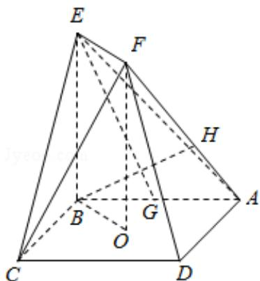

<!-- question-source:start -->
17. （13 分）（2016·天津）如图，正方形 ABCD 的中心为 O，四边形 OBEF 为矩形，平面 OBEF⊥平面 ABCD，点 G 为 AB 的中点，AB=BE=2.

(1) 求证: $EG \parallel$ 平面 ADF;

(2) 求二面角 O - EF - C 的正弦值;

(3) 设 H 为线段 AF 上的点，且 $AH=\frac{2}{3}HF$ ，求直线 BH 和平面 CEF 所成角的正弦值.

【
<!-- question-source:end -->

![[高中/真题/按年份分类/2016/2016年高考理科数学试题_天津卷_及参考答案/解答题/题目/answers/Q00026054A1.md]]
