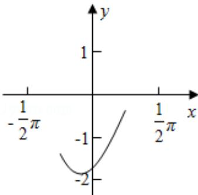

> [!faq]- 2016年高考理科数学试题(天津卷)及参考答案解析
>
> > [!success]- **【答案】** 详见解析
>
> > [!note]- **【分析】**
> > （1）利用三角函数的诱导公式以及两角和差的余弦公式，结合三角函数的辅助角公式进行化简求解即可.
>
> > [!note]- **【解析】**
> > 分析】（1）利用三角函数的诱导公式以及两角和差的余弦公式，结合三角函数的辅助角公式进行化简求解即可.
> >
> > (2) 利用三角函数的单调性进行求解即可.
> >
> > 【
> > 解答】解：（1）∵f(x)=4tanxsin $\left(\frac{\pi}{2}-x\right)$ cos $\left(x-\frac{\pi}{3}\right)-\sqrt{3}$
> >
> > $\therefore \mathrm{x} = k\pi +\frac{\pi}{2}$ ，即函数的定义域为 $\{\mathrm{x}\mid \mathrm{x} = k\pi +\frac{\pi}{2},\mathrm{k}\in \mathbb{Z}\}$
> >
> > 则 $f(x) = 4\tan x\cos x \cdot \left(\frac{1}{2}\cos x + \frac{\sqrt{3}}{2}\sin x\right) - \sqrt{3}$ $= 4\sin x \left( \frac{1}{2}\cos x + \frac{\sqrt{3}}{2}\sin x \right) - \sqrt{3}$ $= 2\sin x\cos x + 2\sqrt{3}\sin^{2}x - \sqrt{3}$ $= \sin 2x + \sqrt{3} (1 - \cos 2x) - \sqrt{3}$ $= \sin 2x - \sqrt{3}\cos 2x$
> >
> > $$
> > = 2 \sin \left(2 x - \frac {\pi}{3}\right)
> > $$
> >
> > 则函数的周期 $T = \frac{2\pi}{2} = \pi$ ;
> >
> > (2) 由 $2k\pi - \frac{\pi}{2} \leq 2x - \frac{\pi}{3} \leq 2k\pi + \frac{\pi}{2}$ , $k \in \mathbb{Z}$ , 得 $k\pi - \frac{\pi}{12} \leq x \leq k\pi + \frac{5\pi}{12}$ , $k \in \mathbb{Z}$ , 即函数的增区间为 $[k\pi - \frac{\pi}{12}, k\pi + \frac{5\pi}{12}]$ , $k \in \mathbb{Z}$ , 当 $k = 0$ 时, 增区间为 $[- \frac{\pi}{12}, \frac{5\pi}{12}]$ , $k \in \mathbb{Z}$ , $\because x \in [-\frac{\pi}{4}, \frac{\pi}{4}]$ , $\therefore$ 此时 $x \in [-\frac{\pi}{12}, \frac{\pi}{4}]$ , 由 $2k\pi + \frac{\pi}{2} \leq 2x - \frac{\pi}{3} \leq 2k\pi + \frac{3\pi}{2}$ , $k \in \mathbb{Z}$ , 得 $k\pi + \frac{5\pi}{12} \leq x \leq k\pi + \frac{11\pi}{12}$ , $k \in \mathbb{Z}$ , 即函数的减区间为 $[k\pi + \frac{5\pi}{12}, k\pi + \frac{11\pi}{12}]$ , $k \in \mathbb{Z}$ , 当 $k = -1$ 时, 减区间为 $[- \frac{7\pi}{12}, -\frac{\pi}{12}]$ , $k \in \mathbb{Z}$ , $\because x \in [-\frac{\pi}{4}, \frac{\pi}{4}]$ , $\therefore$ 此时 $x \in [-\frac{\pi}{4}, -\frac{\pi}{12}]$ , 即在区间 $[- \frac{\pi}{4}, \frac{\pi}{4}]$ 上, 函数的减区间为 $\in [-\frac{\pi}{4}, -\frac{\pi}{12}]$ , 增区间为 $[- \frac{\pi}{12}, \frac{\pi}{4}]$ .
> >
> > 
> >
> > 【点评】本题主要考查三角函数的图象和性质, 利用三角函数的诱导公式, 两角和差的余弦公式以及辅助角公式将函数进行化简是解决本题的关键.
