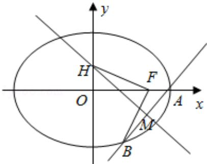

> [!faq]- 2016年高考理科数学试题(天津卷)及参考答案解析
>
> > [!success]- **【答案】** 详见解析
>
> > [!note]- **【分析】**
> > （1）由题意画出图形，把 |OF|、|OA|、|FA| 代入 $\frac{1}{|OF|} + \frac{1}{|OA|} = \frac{3e}{|FA|}$ ，转化为关于 a 的方程，解方程求得 a 值，则椭圆方程可求；
> > (2) 由已知设直线 l 的方程为 $y = k(x - 2)$ ， $(k = 0)$ ，联立直线方程和椭圆方程，化为关于 x 的一元二次方程，利用根与系数的关系求得 B 的坐标，再写出 MH 所在直线方程，求出 H 的坐标，由 BF ⊥ HF，得 $\overrightarrow{BF} \cdot \overrightarrow{HF} = (1 - x_1, -y_1) \cdot (1, -y_H) = 0$ ，整理得到 M 的坐标与 k 的关系，由 $\angle MOA \leq \angle MAO$ ，得到 $x_0 \geq 1$ ，转化为关于 k 的不等式求得 k 的范围.
>
> > [!note]- **【解析】**
> > 解：
> > （1）由 $\frac{1}{|OF|}+\frac{x^{2}}{4}=\frac{3e}{|FA|}$ ，得 $\frac{1}{\sqrt{a^{2}-3}}+\frac{1}{a}=\frac{3\cdot\frac{\sqrt{a^{2}-3}}{a}}{a-\sqrt{a^{2}-3}}$ 即 $\frac{a+\sqrt{a^{2}-3}}{a\cdot\sqrt{a^{2}-3}}=\frac{3\sqrt{a^{2}-3}}{a(a-\sqrt{a^{2}-3})}$ ∴ $a[a^{2}-(a^{2}-3)]=3a(a^{2}-3)$ ，解得a=2.
> > ∴椭圆方程为 $\frac{x^{2}}{4}+\frac{y^{2}}{3}=1$ ;
> > (2) 由已知设直线 l 的方程为 $y = k(x - 2)$ ， $(k = 0)$ ，设 B ( $x_1, y_1$ )，M ( $x_0, k(x_0 - 2)$ )， $\because \angle MOA \leq \angle MAO$ ， $\therefore x_0 \geq 1$ ，
> >
> > 再设 H ( $0, y_H$ )，
> >
> > 联立 $\begin{cases} y = k(x - 2) \\ \frac{x^2}{4} + \frac{y^2}{3} = 1 \end{cases}$ ，得 $(3 + 4k^2)x^2 - 16k^2x + 16k^2 - 12 = 0.$ $\triangle = (-16k^2)^2 - 4(3 + 4k^2)(16k^2 - 12) = 144 > 0.$
> >
> > 由根与系数的关系得 $2\mathrm{x}_{1} = \frac{16\mathrm{k}^{2} - 12}{3 + 4\mathrm{k}^{2}}$
> >
> > $$
> > \therefore_ {\mathbf {x} _ {1}} = \frac {8 k ^ {2} - 6}{3 + 4 k ^ {2}}, \quad y _ {1} = k (x _ {1} - 2) = \frac {- 1 2 k}{3 + 4 k ^ {2}},
> > $$
> >
> > MH 所在直线方程为 $y - k(x_{0} - 2) = -\frac{1}{k}(x - x_{0})$ ,
> >
> > 令 $x = 0$ ，得 $\mathrm{y_H^- (k + \frac{1}{k})x_0 - 2k}$
> >
> > ∵BF⊥HF,
> >
> > $$
> > \because \overrightarrow {\mathrm{BF}} \cdot \overrightarrow {\mathrm{HF}} = (1 - x _ {1}, - y _ {1}) \cdot (1, - y _ {\mathrm{H}}) = 0,
> > $$
> >
> > $$
> > 1 - \mathrm{x} _ {1} + \mathrm{y} _ {1} \mathrm{y} _ {\mathrm{H}} = 1 - \frac {8 \mathrm{k} ^ {2} - 6}{3 + 4 \mathrm{k} ^ {2}} - \frac {1 2 \mathrm{k}}{3 + 4 \mathrm{k} ^ {2}} [ (\mathrm{k} + \frac {1}{\mathrm{k}}) \mathrm{x} _ {0} - 2 \mathrm{k} ] = 0,
> > $$
> >
> > 整理得： $x_{0}=\frac{9+20k^{2}}{12(k^{2}+1)}\geqslant1$ ，即 $8k^{2}\geq3$ .
> >
> > $\therefore k \leqslant -\frac{\sqrt{6}}{4}$ 或 $k \geqslant \frac{\sqrt{6}}{4}$ .
> >
> > 
> >
> > 【点评】本题考查椭圆方程的求法，考查直线与椭圆位置关系的应用，体现了“整体运算”思想方法和“设而不求”的解题思想方法，考查运算能力，是难题.
