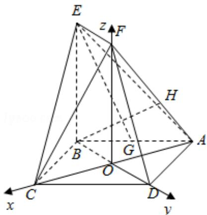

> [!faq]- 2016年高考理科数学试题(天津卷)及参考答案解析
>
> > [!success]- **【答案】** （13 分）（2016·天津）如图，正方形 ABCD 的中心为 O，四边形 OBEF 为矩形，平面 OBEF⊥平面 ABCD，点 G 为 AB 的中点，AB=BE=2
>
> > [!note]- **【分析】**
> > (1) 取 AD 的中点 I, 连接 FI, 证明四边形 EFIG 是平行四边形, 可得 EG∥FI, 利用线面平行的判定定理证明: EG∥平面 ADF;
> > (2) 建立如图所示的坐标系 O - xyz，求出平面 OEF 的法向量，平面 OEF 的法向量，利用向量的夹角公式，即可求二面角 O - EF - C 的正弦值；
> > (3) 求出 $\overrightarrow{\mathrm{BH}} = (-\frac{3\sqrt{2}}{5}, \sqrt{2}, \frac{4}{5})$ ，利用向量的夹角公式求出直线 BH 和平面 CEF 所成角的正弦值.
>
> > [!note]- **【解析】**
> > （1）证明：取 AD 的中点 I，连接 FI，
> >
> > ∵矩形 OBEF，∴EF∥OB，EF=OB，
> >
> > ∵G，I是中点，
> >
> > $\therefore \mathrm{GI}\parallel \mathrm{BD},\mathrm{GI} = \frac{1}{2}\mathrm{BD}.$
> >
> > ∵O 是正方形 ABCD 的中心，
> >
> > $$
> > \therefore \mathrm{OB} = \frac {1}{2} \mathrm{BD}.
> > $$
> >
> > $\therefore \mathrm{EF}\parallel \mathrm{GI},\quad \mathrm{EF} = \mathrm{GI},$
> >
> > ∴四边形 EFIG 是平行四边形，
> >
> > $\therefore EG\|FI,$
> >
> > ∵EG∉平面ADF，FIC平面ADF，
> >
> > ∴EG∥平面 ADF;
> > (2) 解: 建立如图所示的坐标系 O - xyz, 则 B $(0, -\sqrt{2}, 0)$ , C $(\sqrt{2}, 0, 0)$ , E $(0, -\sqrt{2}, 2)$ , F $(0, 0, 2)$ ,
> >
> > 设平面 CEF 的法向量为 $\vec{\pi} = (x, y, z)$ ，则 $\left\{\begin{aligned}\sqrt{2}y &= 0 \\ -\sqrt{2}x + 2z &= 0\end{aligned}\right.$ ，取 $\vec{\pi} = (\sqrt{2}, 0, 1)$
> >
> > ∵OC⊥平面 OEF，
> >
> > ∴平面 OEF 的法向量为 $\vec{n}=(1,0,0)$ ，
> >
> > $$
> > \because | \cos <   \vec {\pi}, \vec {n} > | = \frac {\sqrt {6}}{3}
> > $$
> >
> > ∴二面角 O - EF - C 的正弦值为 $\sqrt{1 - \left(\frac{\sqrt{6}}{3}\right)^{2}} = \frac{\sqrt{3}}{3}$ ;
> > (3) 解： $AH=\frac{2}{3}HF,\quad\therefore\overrightarrow{AH}=\frac{2}{5}\overrightarrow{AF}=\left(\frac{2\sqrt{2}}{5},0,\frac{4}{5}\right)$
> >
> > 设 H (a, b, c)，则 $\overrightarrow{AH} = (a + \sqrt{2}, b, c) = (\frac{2\sqrt{2}}{5}, 0, \frac{4}{5})$ .
> >
> > $$
> > \therefore a = - \frac {3 \sqrt {2}}{5}, b = 0, c = \frac {4}{5},
> > $$
> >
> > $$
> > \therefore \overrightarrow {\mathrm{BH}} = (- \frac {3 \sqrt {2}}{5}, \sqrt {2}, \frac {4}{5})
> > $$
> >
> > ∴直线 BH 和平面 CEF 所成角的正弦值= $|\cos<\overrightarrow{BH},\quad\overrightarrow{n}>|=\frac{\left|-\frac{6}{5}+\frac{4}{5}\right|}{\sqrt{3}\cdot\frac{2\sqrt{21}}{5}}=\frac{\sqrt{7}}{21}$ .
> >
> > 
