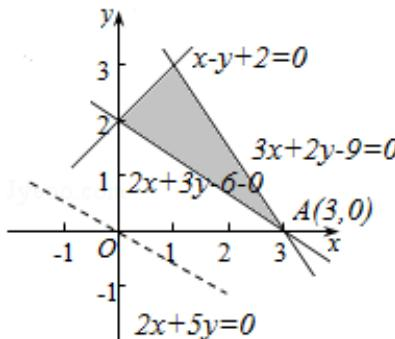

> [!faq]- 2016年高考理科数学试题(天津卷)及参考答案解析
>
> > [!success]- **【答案】** B
>
> > [!note]- **【分析】**
> > 作出不等式组表示的平面区域，作出直线 $l_{0}:2x+5y=0$ ，平移直线 $l_{0}$ ，可得经过点(3,0)时， $z=2x+5y$ 取得最小值6.
> > 【
>
> > [!note]- **【解析】**
> > 解：作出不等式组 $\left\{\begin{aligned}&x-y+2\geqslant0\\ &2x+3y-6\geqslant0\\ &3x+2y-9\leqslant0\end{aligned}\right.$ 表示的可行域，
> >
> > 如右图中三角形的区域，
> >
> > 作出直线 $l_{0}$ ： $2x+5y=0$ ，图中的虚线，
> >
> > 平移直线 $l_{0}$ ，可得经过点（3，0）时， $z=2x+5y$ 取得最小值 6.
> >
> > 故选：B.
> >
> > 
> >
> > 【点评】本题考查简单线性规划的应用, 涉及二元一次不等式组表示的平面区域, 关键是准确作出不等式组表示的平面区域.
