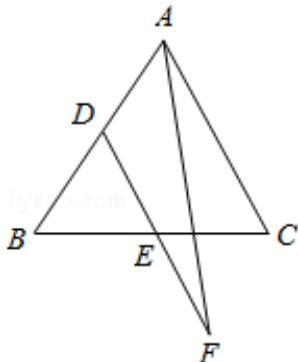

> [!faq]- 2016年高考理科数学试题(天津卷)及参考答案解析
>
> > [!success]- **【答案】** B
>
> > [!note]- **【分析】**
> > 运用向量的加法运算和中点的向量表示, 结合向量的数量积的定义和性质, 向量的平方即为模的平方, 计算即可得到所求值.
>
> > [!note]- **【解析】**
> > 解：由 DD、E 分别是边 AB、BC 的中点，DE=2EF，可得 $\overrightarrow{AF} \cdot \overrightarrow{BC} = (\overrightarrow{AD} + \overrightarrow{DF}) \cdot (\overrightarrow{AC} - \overrightarrow{AB})$ $=\left(\frac{1}{2}\overrightarrow{AB}+\frac{3}{2}\overrightarrow{DE}\right)\cdot\left(\overrightarrow{AC}-\overrightarrow{AB}\right)$ $=\left(\frac{1}{2}\overrightarrow{AB}+\frac{3}{4}\overrightarrow{AC}\right)\cdot\left(\overrightarrow{AC}-\overrightarrow{AB}\right)$ $=\frac{3}{4}\overrightarrow{AC}^{2}-\frac{1}{4}\overrightarrow{AB}\cdot\overrightarrow{AC}-\frac{1}{2}\overrightarrow{AB}^{2}=\frac{3}{4}-\frac{1}{4}\cdot1\cdot1\cdot\frac{1}{2}-\frac{1}{2}$ $=\frac{1}{8}.$
> >
> > 故选：B.
> >
> > 
> >
> > 【点评】本题考查了数量积的定义和性质, 注意运用向量的中点的表示, 考查计算能力, 属于中档题.
