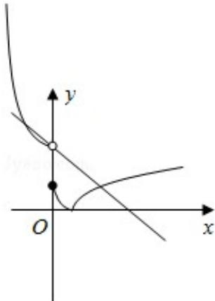

> [!faq]- 2016年高考理科数学试题(天津卷)及参考答案解析
>
> > [!success]- **【答案】** C
>
> > [!note]- **【分析】**
> > 利用函数是减函数，根据对数的图象和性质判断出a的大致范围，再根据 $f(x)$ 为减函数，得到不等式组，利用函数的图象，方程的解的个数，推出a的范围.
>
> > [!note]- **【解析】**
> > 解： $y=\log a(x+1)+1$ 在 $[0,+\infty)$ 递减，则 0<a<1，
> >
> > 函数 $f(x)$ 在 $R$ 上单调递减，则则：
> >
> > 函数 $P(x)$ 在 $\mathbb{R}$ 上单调递减，则则： $\left\{ \begin{array}{l} \frac{3 - 4a}{2} \geqslant 0 \\ 0 < a < 1 \\ 0^2 + (4a - 3) \cdot 0 + 3a \geqslant \log_a(0 + 1) + 1 \end{array} \right.$
> >
> > 解得， $\frac{1}{3} \leqslant a \leqslant \frac{3}{4}$
> >
> > 由图象可知，在 $[0, +\infty)$ 上， $|f(x)| = 2 - x$ 有且仅有一个解，故在 $(- \infty, 0)$ 上， $|f(x)| = 2 - x$ 同样有且仅有一个解，
> >
> > 当 $3a > 2$ 即 $a > \frac{2}{3}$ 时，联立 $\left|x^{2} + (4a - 3) + 3a\right| = 2 - x,$
> >
> > 则 $\triangle = (4a - 2)^{2} - 4(3a - 2) = 0,$
> >
> > 解得 $a = \frac{3}{4}$ 或1（舍去），
> >
> > 当 $1 \leq 3a \leq 2$ 时，由图象可知，符合条件，
> >
> > 综上：a的取值范围为 $[\frac{1}{3},\frac{2}{3} ]\cup \{\frac{3}{4}\}$
> >
> > 故选：C.
> >
> > 
> >
> > 【点评】本题考查了方程的解个数问题，以及参数的取值范围，考查了学生的分析问题，解决问题的能力，以及数形结合的思想，属于中档题.
> >
> > ##
> > 二、填空题
