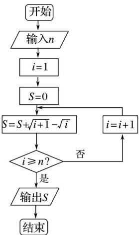

<!-- question-source:start -->
11. (2016·山东, 11)执行如图所示的程序框图, 若输入 $n$ 的值为 3 , 则输出的 $S$ 的值为 $\_\_\_\_.$

<!-- question-source:end -->

![[高中/真题/按年份分类/2016/2016年高考真题数学_文__山东卷__含解析版_/填空题/题目/answers/Q00023408A1.md]]
