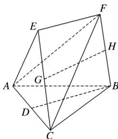

<!-- question-source:start -->
18. (2016·山东, 18)(本小题满分12分)在如图所示的几何体中, $D$ 是 $AC$ 的中点, $EF\|DB$ .

(1)已知 $AB = BC$ ， $AE = EC.$ 求证： $AC \perp FB$

(2)已知 G，H 分别是 EC 和 FB 的中点．求证：GH∥平面 ABC.
<!-- question-source:end -->

![[高中/真题/按年份分类/2016/2016年高考真题数学_文__山东卷__含解析版_/解答题/题目/answers/Q00023415A1.md]]
