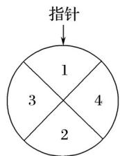

<!-- question-source:start -->
16. (2016·山东, 16)(本小题满分 12 分)某儿童乐园在 “六一” 儿童节推出了一项趣味活动。参加活动的儿童需转动如图所示的转盘两次，每次转动后，待转盘停止转动时，记录指针所指区域中的数。设两次记录的数分别为 $x$ ， $y$ .奖励规则如下：

① 若 $xy \leq 3$ ，则奖励玩具一个；

② 若 $xy \geq 8$ ，则奖励水杯一个；

③ 其余情况奖励饮料一瓶.

假设转盘质地均匀，四个区域划分均匀，小亮准备参加此项活动.
<!-- question-source:end -->

![[高中/真题/按年份分类/2016/2016年高考真题数学_文__山东卷__含解析版_/解答题/题目/answers/Q00028563A1.md]]
