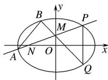

<!-- question-source:start -->
21. (2016·山东, 21)(本小题满分 14 分)已知椭圆 $C: + = 1 (a > b > 0)$ 的长轴长为 4, 焦距为 2.

(1)求椭圆 C 的方程;

(2)过动点 $M(0, m)(m > 0)$ 的直线交 $x$ 轴于点 $N$ ，交 $C$ 于点 $A$ ， $P(P$ 在第一象限)，且 $M$ 是线段 $PN$ 的中点。过点 $P$ 作 $x$ 轴的垂线交 $C$ 于另一点 $Q$ ，延长 $QM$ 交 $C$ 于点 $B$ .

① 设直线 PM、QM 的斜率分别为 k、 $k'$ ，证明为定值.

② 求直线 $AB$ 的斜率的最小值.
<!-- question-source:end -->

![[高中/真题/按年份分类/2016/2016年高考真题数学_文__山东卷__含解析版_/解答题/题目/answers/Q00031019A1.md]]
