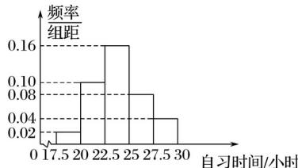

<!-- question-source:start -->
3. (2016·山东, 3)某高校调查了200名学生每周的自习时间(单位: 小时), 制成了如图所示的频率分布直方图, 其中自习时间的范围是[17.5,30], 样本数据分组为[17.5,20), [20,22.5), [22.5,25), [25,27.5), [27.5,30]. 根据直方图, 这200名学生中每周的自习时间不少于22.5小时的人数是()

A. 56 B. 60 C. 120 D. 140
<!-- question-source:end -->

![[高中/真题/按年份分类/2016/2016年高考真题数学_文__山东卷__含解析版_/选择题/题目/answers/Q00023400A1.md]]
