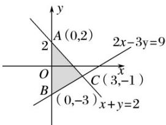

> [!faq]- 2016年高考真题数学【文】(山东卷)（含解析版）解析
>
> > [!success]- **【答案】** C
>
> > [!note]- **【分析】**
> > 本题未单列分析。
>
> > [!note]- **【解析】**
> > 满足条件的可行域如下图阴影部分(包括边界). $x^{2} + y^{2}$ 是可行域上动点 $(x, y)$ 到原点 $(0, 0)$ 距离的平方，显然当 x = 3，y = -1 时， $x^{2} + y^{2}$ 取最大值，最大值为 10. 故选 C.
> >
> > 
