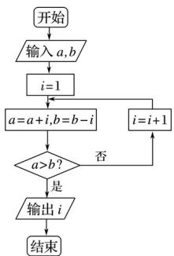

<!-- question-source:start -->
11. (2016·山东理, 11)执行如图所示的程序框图, 若输入的 $a$ , $b$ 的值分别为 0 和 9 , 则输出的 $i$ 的值为

<!-- question-source:end -->

![[高中/真题/按年份分类/2016/2016年高考真题数学_理__山东卷__含解析版_/填空题/题目/answers/Q00023450A1.md]]
