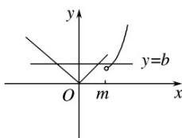

> [!faq]- 2016年高考真题数学【理】(山东卷)（含解析版）解析
>
> > [!success]- **【答案】** $(3, +\infty)$
>
> > [!note]- **【分析】**
> > 本题未单列分析。
>
> > [!note]- **【解析】**
> > 如图，当 $x \leq m$ 时， $f(x) = |x|$ ; 当 x > m 时， $f(x) = x^{2} - 2mx + 4m$ ，在 $(m, +\infty)$ 为增函数，若存在实数 b，使方程 $f(x) = b$ 有三个不同的根，则 $m^{2} - 2m \cdot m + 4m < |m|$ : $\because m > 0$ , $\therefore m^{2} - 3m > 0$ ，解得 m > 3.
> >
> > 
