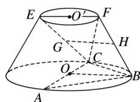

<!-- question-source:start -->
17. (2016·山东理, 17)在如图所示的圆台中, $AC$ 是下底面圆 $O$ 的直径, $EF$ 是上底面圆 $O'$ 的直径, $FB$ 是圆台的一条母线.

(1)已知 G，H 分别为 EC，FB 的中点，求证：GH∥平面 ABC；

(2)已知 $EF = FB = AC = 2$ ， $AB = BC$ ，求二面角 $F - BC - A$ 的余弦值.
<!-- question-source:end -->

![[高中/真题/按年份分类/2016/2016年高考真题数学_理__山东卷__含解析版_/解答题/题目/answers/Q00023456A1.md]]
