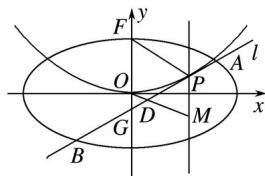

<!-- question-source:start -->
21. (2016·山东理, 21)平面直角坐标系 $xOy$ 中, 椭圆 $C: + = 1(a > b > 0)$ 的离心率是, 抛物线 $E: x^2 = 2y$ 的焦点 $F$ 是 $C$ 的一个顶点.

<!-- question-source:end -->

![[高中/真题/按年份分类/2016/2016年高考真题数学_理__山东卷__含解析版_/解答题/题目/answers/Q00028585A1.md]]
