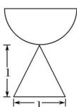
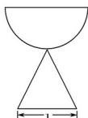
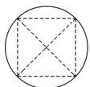

<!-- question-source:start -->
5. (2016·山东理, 5)一个由半球和四棱锥组成的几何体, 其三视图如图所示, 则该几何体的体积为( )

  
正(主)视图

  
侧（左）视图  
俯视图

A. $+\pi$ B. $+\pi$ C. $+\pi$ D. $1+\pi$
<!-- question-source:end -->

![[高中/真题/按年份分类/2016/2016年高考真题数学_理__山东卷__含解析版_/选择题/题目/answers/Q00023444A1.md]]
