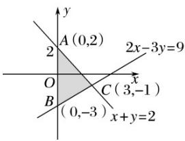

> [!faq]- 2016年高考真题数学【理】(山东卷)（含解析版）解析
>
> > [!success]- **【答案】** C
>
> > [!note]- **【分析】**
> > 本题未单列分析。
>
> > [!note]- **【解析】**
> > 满足条件的可行域如下图阴影部分(包括边界)， $x^{2}+y^{2}$ 是可行域上动点(x, y)到原点(0,0)距离的平方，显然，当x=3，y=-1时， $x^{2}+y^{2}$ 取最大值，最大值为10.故选C.
> >
> > 
