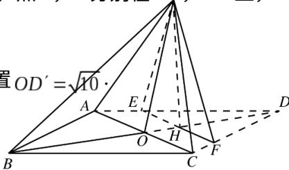

<!-- question-source:start -->
## 19. (本小题满分 12 分)

如图，菱形ABCD的对角线AC与BD交于点O，AB=5，AC=6，点E，F分别在ADQ'CD上，

$AE = CF = \frac{5}{4}$ ， $EF$ 交 $BD$ 于点 $H.$ 将 $\triangle DEF$ 沿 $EF$ 折到 $\triangle D'EF$ 的位置 $OD$

(I) 证明： $D'H \perp$ 平面 ABCD;

(II) 求二面角 $B - D'A - C$ 的正弦值.
<!-- question-source:end -->

![[高中/真题/按年份分类/2016/2016年高考重庆理科数学试题及答案_精校版_/解答题/题目/answers/Q00028592A1.md]]
