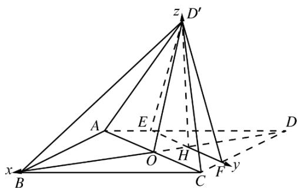

> [!faq]- 2016年高考重庆理科数学试题及答案(精校版)解析
>
> > [!success]- **【答案】** 详见解析
>
> > [!note]- **【分析】**
> > 本题未单列分析。
>
> > [!note]- **【解析】**
> > (1)证明：∵ $AE = CF = \frac{5}{4}$ ,
> >
> > $$
> > \therefore \frac {A E}{A D} = \frac {C F}{C D},
> > $$
> >
> > $\therefore EF \parallel AC.$
> >
> > ∵四边形 ABCD 为菱形，
> >
> > $$
> > \therefore A C \perp B D,
> > $$
> >
> > $$
> > \therefore E F \perp B D,
> > $$
> >
> > $$
> > \therefore E F \perp D H,
> > $$
> >
> > $\therefore EF \perp D'H$ .
> >
> > $\because AC=6,$
> >
> > $$
> > \therefore A O = 3
> > $$
> >
> > 又 $AB = 5$ ， $AO\perp OB$
> >
> > $$
> > \therefore O B = 4,
> > $$
> >
> > $$
> > \begin{array}{c} O H = \frac {A E}{A O} \cdot O D = 1 \\ \therefore \end{array}
> > $$
> >
> > $$
> > \therefore \left| O D ^ {\prime} \right| ^ {2} = \left| O H \right| ^ {2} + \left| D ^ {\prime} H \right| ^ {2}
> > $$
> >
> > $$
> > \therefore D ^ {\prime} H \perp O H
> > $$
> >
> > 又∵OH I EF = H，
> >
> > $$
> > \therefore D ^ {\prime} H \perp \text { 面 } A B C D.
> > $$
> >
> > (2) 建立如图坐标系 H - xyz .
> >
> > 
> >
> > $$
> > B (5, 0, 0), C (1, 3, 0), D ^ {\prime} (0, 0, 3), A (1, - 3, 0),
> > $$
> >
> > $$
> > \stackrel {\text {uu}} {A B} = (4, 3, 0), \quad \stackrel {\text {uu}} {A D ^ {\prime}} = (- 1, 3, 3), \quad \stackrel {\text {uu}} {A C} = (0, 6, 0),
> > $$
> >
> > 设面 $ABD'$ 法向量 $\mathbf{u}_{n_{1}} = (x, y, z)$ ，
> >
> > $$
> > \text {由} \left\{ \begin{array}{l} n _ {1} \cdot A B = 0 \\ n _ {1} \cdot A D ^ {\prime} = 0 \end{array} \right. \text {得} \left\{ \begin{array}{l} 4 x + 3 y = 0 \\ - x + 3 y + 3 z = 0 \end{array} \right., \text {取} \left\{ \begin{array}{l} x = 3 \\ y = - 4 \\ z = 5 \end{array} \right.,
> > $$
> >
> > $\therefore n_{1}=(3,-4,5)$
> >
> > 同理可得面 $AD^{\prime}C$ 的法向量 $n_{2}^{u}= (3,0,1)$ ,
> >
> > $\left|\cos \theta \right| = \frac{\left|\begin{array}{cc}\mathbf{u} & \mathbf{u}\\ n_1 & n_2 \end{array}\right|}{\left|\begin{array}{cc}\mathbf{u} & \mathbf{u}\\ n_1 & n_2 \end{array}\right|} = \frac{|9 + 5|}{5\sqrt{2}\cdot\sqrt{10}} = \frac{7\sqrt{5}}{25}$
> >
> > $\sin \theta = \frac{2\sqrt{95}}{25}$
