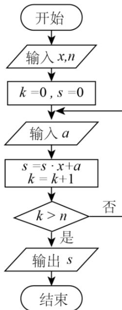

<!-- question-source:start -->
9. 若 $\cos\left(\frac{\pi}{4}-\alpha\right)=\frac{3}{5}$ ，则 $\sin2\alpha=$ (A) $\frac{7}{25}$ (B) $\frac{1}{5}$ (C) $-\frac{1}{5}$ (D) $-\frac{7}{25}$

<!-- question-source:end -->

![[高中/真题/按年份分类/2016/2016年高考重庆理科数学试题及答案_精校版_/选择题/题目/answers/Q00025648A1.md]]
