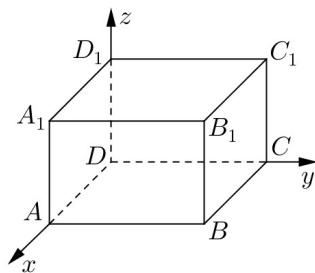

<!-- question-source:start -->
6. 设双曲线 $\frac{x^{2}}{9}-\frac{y^{2}}{b^{2}}=1(b>0)$ 的焦点为 $F_{1}$ 、 $F_{2}$ ，P 为该双曲线上的一点，若 $\left|PF_{1}\right|=5$ ，则 $\left|PF_{2}\right|=$ \_\_\_\_

<!-- question-source:end -->

![[高中/真题/按年份分类/2017/2017年上海高考数学真题试卷_word解析版_/填空题/题目/answers/Q00023950A1.md]]
