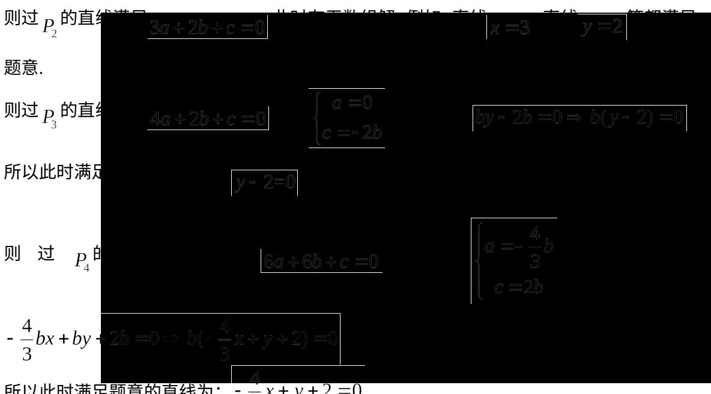

> [!faq]- 2017年上海高考数学真题试卷（word解析版）解析
>
> > [!success]- **【答案】** $P_{1}, P_{3}, P_{4}$ ## 二、选择题（本大题共有4题，满分20分，每题5分）每题有且只有一个正确选项。考生应在答题纸的相应位置，将代表正确选项的小方格涂黑。
>
> > [!note]- **【分析】**
> > 本题未单列分析。
>
> > [!note]- **【解析】**
> > 本题考查有向距离, 以左下角的顶点为原点建立直角坐标系。四个标记为 “▲” 的点的坐标分别为 $(0,3)$ , $(1,0)$ , $(4,4)$ , $(7,1)$ , 设过 P 点的直线为: $ax + by + c = 0$ ,
> >
> > 此时有向距离 $d_{1} = \frac{3b + c}{\sqrt{a^{2} + b^{2}}}, d_{2} = \frac{a + c}{\sqrt{a^{2} + b^{2}}}, d_{3} = \frac{4a + 4b + c}{\sqrt{a^{2} + b^{2}}}, d_{4} = \frac{7a + b + c}{\sqrt{a^{2} + b^{2}}}$
> >
> > 且由 $d_{1} + d_{2} + d_{3} + d_{4} = 12a + 8b + 4c = 0\Rightarrow 3a + 2b + c = 0$
> >
> > 则过 $P_{1}$ 的直线满足 $4b + c = 0$ ；此时 $\left\{ \begin{array}{l} a = -\frac{2}{3} b, \\ c = -4b \end{array} \right.$ ，直线为：
> >
> > $$
> > - \frac {2}{3} b x + b y - 4 b = 0 \Rightarrow b \left(- \frac {2}{3} x + y - 4\right) = 0:
> > $$
> >
> > 所以此时满足题意的直线为： $-\frac{2}{3} x + y - 4 = 0$
> >
> > 
> >
> > 所以此时满足题意的直线为： $-\frac{1}{3}x+y+2=0$
> >
> > 【
