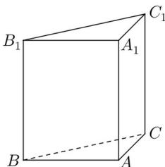

<!-- question-source:start -->
17. 如图，直三棱柱 $ABC - A_{1}B_{1}C_{1}$ 的底面为直角三角形，两直角边 $AB$ 和 $AC$ 的长分别为 4 和 2，侧棱 $AA_{1}$ 的长为 5.

(1) 求三棱柱 $ABC - A_{1}B_{1}C_{1}$ 的体积;

(2) 设 $M$ 是 $BC$ 中点，求直线 $A_{1}M$

与平面 ABC 所成角的大小.
<!-- question-source:end -->

![[高中/真题/按年份分类/2017/2017年上海高考数学真题试卷_word解析版_/解答题/题目/answers/Q00023961A1.md]]
